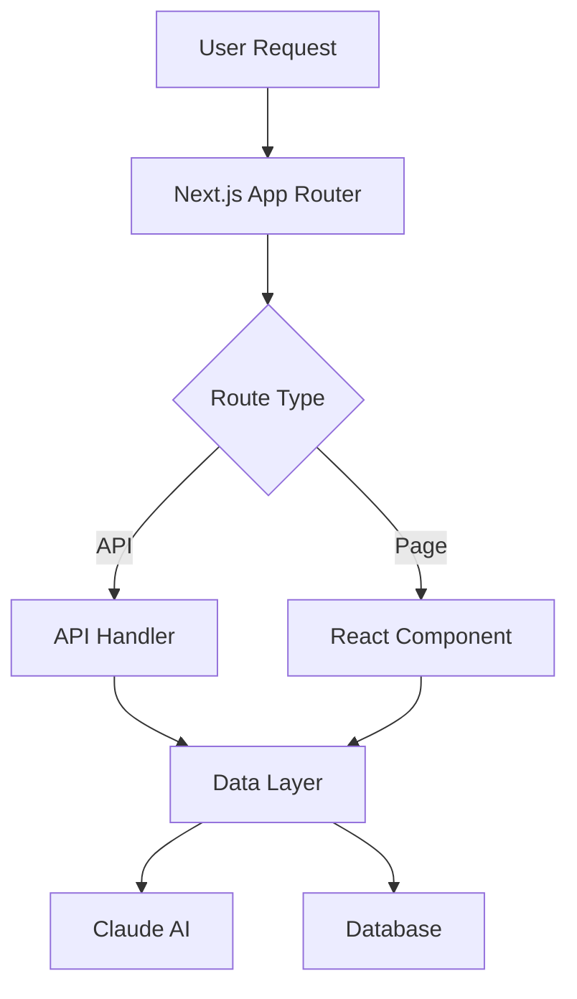
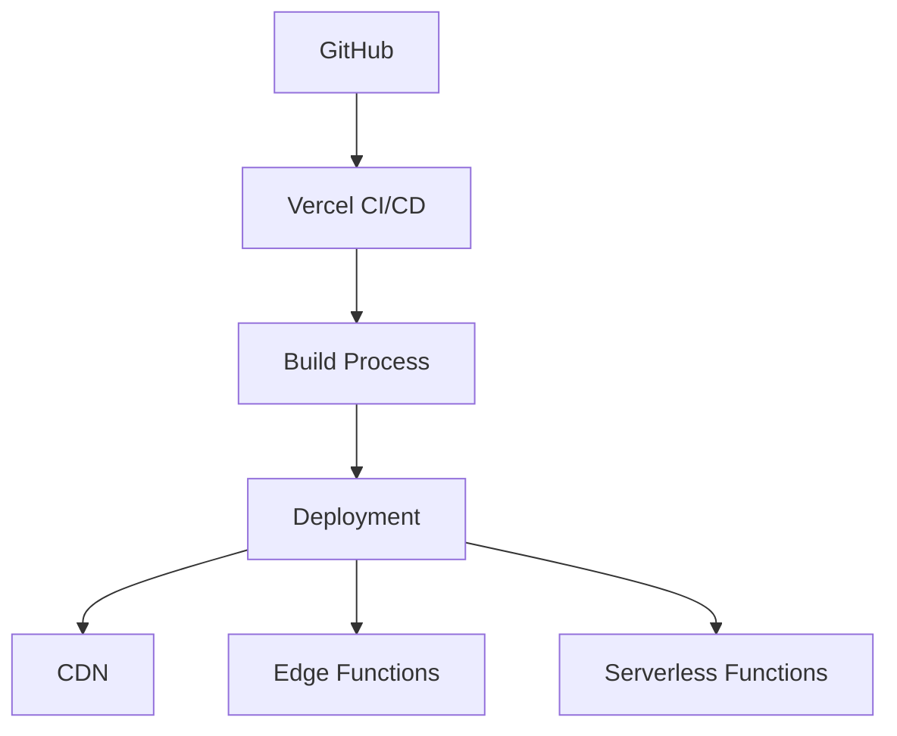

# Project Architecture and Structure

This document outlines the architecture and organization of the AI Self-Generating Blog platform.

## Project Structure

```
src/
├── app/                    # Next.js 14 App Router
│   ├── api/               # API routes
│   │   ├── generate/     # AI generation endpoints
│   │   └── posts/        # Blog post endpoints
│   ├── blog/             # Blog pages
│   │   ├── [slug]/       # Individual post pages
│   │   └── page.tsx      # Blog listing page
│   └── page.tsx          # Landing page
│
├── components/            # React components
│   ├── blog/             # Blog-specific components
│   │   ├── BlogCard.tsx
│   │   ├── BlogContent.tsx
│   │   └── BlogLayout.tsx
│   ├── layout/           # Layout components
│   │   ├── Footer.tsx
│   │   ├── Header.tsx
│   │   └── Navigation.tsx
│   └── ui/               # Reusable UI components
│       ├── Button.tsx
│       ├── Card.tsx
│       └── Input.tsx
│
├── lib/                  # Utility functions and services
│   ├── claude/           # Claude AI integration
│   │   ├── config.ts
│   │   ├── generate.ts
│   │   └── types.ts
│   ├── markdown/         # Markdown processing
│   │   ├── parser.ts
│   │   └── syntax.ts
│   └── utils/           # Helper functions
│       ├── date.ts
│       └── string.ts
│
├── styles/              # Global styles and themes
│   ├── globals.css
│   └── themes/
│
└── types/               # TypeScript type definitions
    ├── blog.ts
    └── api.ts
```

## Core Components

### 1. AI Generation System

```typescript
// lib/claude/generate.ts
export class ContentGenerator {
  private claude: Claude;
  private config: GenerationConfig;

  constructor(config: GenerationConfig) {
    this.claude = new Claude(config.apiKey);
    this.config = config;
  }

  async generatePost(topic: string): Promise<BlogPost> {
    // Generation logic
  }
}
```

### 2. Blog System

```typescript
// components/blog/BlogLayout.tsx
export function BlogLayout({ children }: BlogLayoutProps) {
  return (
    <div className="blog-layout">
      <Sidebar />
      <main>{children}</main>
      <TableOfContents />
    </div>
  );
}
```

### 3. API Layer

```typescript
// app/api/posts/route.ts
export async function GET(request: Request) {
  // API logic
}

export async function POST(request: Request) {
  // Post creation logic
}
```

## Data Flow



## Key Design Patterns

### 1. Repository Pattern

```typescript
// lib/repositories/PostRepository.ts
export class PostRepository {
  async findAll(): Promise<Post[]> {
    // Implementation
  }

  async findBySlug(slug: string): Promise<Post | null> {
    // Implementation
  }

  async create(post: CreatePostDTO): Promise<Post> {
    // Implementation
  }
}
```

### 2. Service Pattern

```typescript
// lib/services/BlogService.ts
export class BlogService {
  constructor(
    private postRepo: PostRepository,
    private generator: ContentGenerator
  ) {}

  async generateAndPublish(topic: string): Promise<Post> {
    const content = await this.generator.generatePost(topic);
    return this.postRepo.create(content);
  }
}
```

### 3. Factory Pattern

```typescript
// lib/factories/PostFactory.ts
export class PostFactory {
  static createFromGenerated(
    generated: GeneratedContent
  ): Post {
    return {
      title: generated.title,
      content: generated.content,
      slug: slugify(generated.title),
      // Other properties
    };
  }
}
```

## State Management

### 1. Server Components

```typescript
// app/blog/page.tsx
export default async function BlogPage() {
  const posts = await getPosts();
  
  return (
    <div>
      {posts.map(post => (
        <BlogCard key={post.id} post={post} />
      ))}
    </div>
  );
}
```

### 2. Client Components

```typescript
'use client';

// components/blog/PostViewer.tsx
export function PostViewer({ post }: PostViewerProps) {
  const [isExpanded, setIsExpanded] = useState(false);
  
  return (
    <article>
      {/* Component content */}
    </article>
  );
}
```

## Performance Optimizations

### 1. Static Generation

```typescript
// app/blog/[slug]/page.tsx
export async function generateStaticParams() {
  const posts = await getPosts();
  
  return posts.map((post) => ({
    slug: post.slug,
  }));
}
```

### 2. Caching

```typescript
// lib/cache.ts
export const cache = new LRUCache({
  max: 500,
  maxAge: 1000 * 60 * 60, // 1 hour
});
```

## Security Measures

### 1. Input Validation

```typescript
// lib/validation/post.ts
export function validatePost(input: unknown): Post {
  const schema = z.object({
    title: z.string().min(1).max(200),
    content: z.string().min(1),
    // Other validations
  });
  
  return schema.parse(input);
}
```

### 2. Authentication

```typescript
// middleware.ts
export function middleware(request: NextRequest) {
  // Authentication logic
}
```

## Error Handling

### 1. Global Error Boundary

```typescript
// app/error.tsx
'use client';

export default function Error({
  error,
  reset,
}: {
  error: Error;
  reset: () => void;
}) {
  return (
    <div>
      <h2>Something went wrong!</h2>
      <button onClick={reset}>Try again</button>
    </div>
  );
}
```

### 2. API Error Handling

```typescript
// lib/errors/api.ts
export class APIError extends Error {
  constructor(
    message: string,
    public statusCode: number,
    public code: string
  ) {
    super(message);
  }
}
```

## Testing Strategy

### 1. Unit Tests

```typescript
// __tests__/unit/PostService.test.ts
describe('PostService', () => {
  it('should generate and publish posts', async () => {
    // Test implementation
  });
});
```

### 2. Integration Tests

```typescript
// __tests__/integration/api.test.ts
describe('Post API', () => {
  it('should create new posts', async () => {
    // Test implementation
  });
});
```

## Monitoring and Logging

```typescript
// lib/monitoring/logger.ts
export const logger = {
  info: (message: string, meta?: object) => {
    // Logging implementation
  },
  error: (error: Error, meta?: object) => {
    // Error logging implementation
  },
};
```

## Deployment Architecture



## Future Considerations

1. **Scalability**
   - Implement horizontal scaling
   - Add caching layers
   - Optimize database queries

2. **Features**
   - Add image generation
   - Implement user comments
   - Add social sharing

3. **Performance**
   - Add service workers
   - Implement progressive loading
   - Optimize bundle size

## Contributing

See [CONTRIBUTING.md](../../CONTRIBUTING.md) for development guidelines and processes.