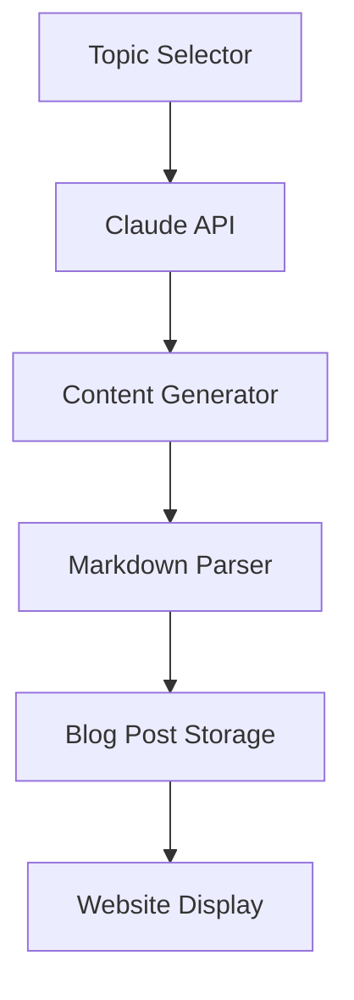

# AI Content Generation

The AI Self-Generating Blog platform uses Claude 3.5 Sonnet to automatically generate high-quality technical content. This document explains how the AI generation system works and how to customize it.

## Overview

The platform uses Anthropic's Claude 3.5 Sonnet model to:
- Generate daily blog posts automatically
- Create technically accurate content
- Format content with proper markdown
- Include relevant code examples
- Generate SEO-friendly metadata

## Architecture



## Configuration

### Basic Settings

Located in `src/lib/claude/config.ts`:
```typescript
export const GENERATION_CONFIG = {
  model: 'claude-3-sonnet-20240229',
  maxTokens: 4000,
  temperature: 0.7,
  topics: [
    'Web Development',
    'System Design',
    'AI/ML',
    // Add more topics
  ],
  schedule: '0 0 * * *' // Daily at midnight
};
```

### Prompt Templates

Located in `src/lib/claude/prompts.ts`:
```typescript
export const BLOG_POST_PROMPT = `
Generate a technical blog post about {topic}.
The post should:
- Be detailed and informative
- Include code examples
- Use proper markdown formatting
- Maintain a professional tone
- Include SEO metadata
`;
```

## Generation Process

1. **Topic Selection**
   ```typescript
   // Automatic topic selection
   const topic = await selectTopic();
   
   // Manual topic selection
   const topic = 'Specified Topic';
   ```

2. **Content Generation**
   ```typescript
   const post = await streamBlogPost(topic);
   ```

3. **Post Processing**
   ```typescript
   const processedContent = await processMarkdown(post.content);
   ```

## Customization

### Adding Custom Topics

1. Update the topics list in `src/lib/claude/config.ts`:
   ```typescript
   export const TOPICS = [
     'Your New Topic',
     // Other topics...
   ];
   ```

2. Add topic-specific prompts (optional):
   ```typescript
   export const TOPIC_PROMPTS = {
     'Your New Topic': `Custom prompt for this topic...`,
   };
   ```

### Modifying Generation Parameters

```typescript
export const GENERATION_PARAMS = {
  basic: {
    temperature: 0.7,
    maxTokens: 4000,
  },
  advanced: {
    topP: 0.9,
    frequencyPenalty: 0.3,
    presencePenalty: 0.3,
  },
};
```

## Scheduling

### Default Schedule
Posts are generated daily at midnight UTC. Configure in `src/lib/cron/config.ts`:
```typescript
export const CRON_CONFIG = {
  generatePost: '0 0 * * *', // Daily at midnight
  cleanup: '0 1 * * *',      // Daily at 1 AM
};
```

### Custom Scheduling
```typescript
// Custom schedule example
import { scheduleGeneration } from '@/lib/cron';

scheduleGeneration({
  cronExpression: '0 */12 * * *', // Every 12 hours
  topics: ['Custom Topic'],
});
```

## Error Handling

The system includes robust error handling:

```typescript
try {
  const post = await streamBlogPost(topic);
} catch (error) {
  if (error instanceof ClaudeAPIError) {
    // Handle API errors
    logger.error('Claude API Error:', error);
    await notifyAdmin(error);
  } else {
    // Handle other errors
    logger.error('Generation Error:', error);
  }
}
```

## Monitoring

### Generation Logs
```typescript
// Enable detailed logging
export const LOGGING_CONFIG = {
  level: 'debug',
  generations: true,
  api: true,
};
```

### Performance Metrics
```typescript
export const METRICS_CONFIG = {
  trackGenerationTime: true,
  trackTokenUsage: true,
  trackTopicDistribution: true,
};
```

## Best Practices

1. **Topic Selection**
   - Keep topics focused and specific
   - Maintain a good variety
   - Avoid overlapping topics

2. **Content Quality**
   - Review generated content regularly
   - Adjust prompts based on output quality
   - Monitor for technical accuracy

3. **Resource Management**
   - Track API usage
   - Implement rate limiting
   - Cache generated content

## Troubleshooting

Common issues and solutions:

| Issue | Solution |
|-------|----------|
| Low-quality content | Adjust temperature and prompts |
| Generation timeout | Reduce maxTokens or split generation |
| Rate limiting | Implement backoff strategy |
| Duplicate content | Improve topic selection logic |

## API Reference

### Generation Endpoint
```typescript
POST /api/generate
Content-Type: application/json

{
  "topic": string,
  "options": {
    "temperature": number,
    "maxTokens": number
  }
}
```

### Response Format
```typescript
{
  "title": string,
  "content": string,
  "excerpt": string,
  "metadata": {
    "readingTime": number,
    "topics": string[],
    "seoDescription": string
  }
}
```

## Future Improvements

- [ ] Implement content quality scoring
- [ ] Add topic clustering
- [ ] Enhance code example generation
- [ ] Improve SEO optimization
- [ ] Add image generation support

## Resources

- [Claude API Documentation](https://docs.anthropic.com/)
- [Content Generation Best Practices](../best-practices/content.md)
- [Advanced Configuration](../customization/advanced.md)